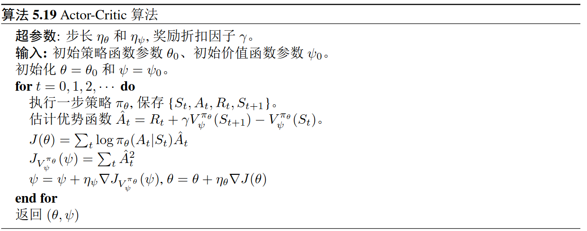

# AC

`Actor-Critic`算法是一个既基于**策略**也基于**价值**的方法。

- 用状态价值函数作为基准函数来降低梯度估计的方差。
- 行动者(Actor)函数: $\pi(\cdot|s)$
- 批判者(Critic)函数:  $V^\pi(s)$
- 沿用了**自举法**(Bootstrapping)的思想来估计 $Q$ 值函数。
- `REINFORCE`中的误差项 $\sum_{t=i}^\infty\gamma^{t-i}R_t-b(S_i)$ 被时间差分误差取代了，即 $R_i+\gamma V^{\pi}(S_{i+1})-V^{\pi}(S_i)$

这里采用 $L$ 步的时间差分误差，并通过最小化该误差的平方来学习批判者函数 $V_{\psi}^{\pi_\theta}\left(s\right)$ ,

$$
\psi\leftarrow\psi-\eta_\psi\nabla J_{V_\psi^{\pi_\theta}}\left(\psi\right)\tag{1}
$$

- $\psi$ 表示学习批判者函数的参数
- $\eta_\mathrm{\psi}$ 是学习步长

$$
J_{V_\psi^{\pi_\theta}}\left(\psi\right)=\frac12\left(\sum_{t=i}^{i+L-1}\gamma^{t-i}R_t+\gamma^LV_\psi^{\pi_\theta}\left(S^{\prime}\right)-V_\psi^{\pi_\theta}\left(S_i\right)\right)^2\tag{2}
$$

$S^{\prime}$ 是智能体在 $\pi_\theta$ 下 $L$ 步之后到达的状态,所以

$$\nabla J_{V_\psi^{\pi_\theta}}(\psi)=\left(V_\psi^{\pi_\theta}(S_i)-\sum_{t=i}^{i+L-1}\gamma^{t-i}R_t-\gamma^LV_\psi^{\pi_\theta}(S^{\prime})\right)\nabla V_\psi^{\pi_\theta}(S_i)\tag{3}$$

类似地，行动者函数 $\pi(\cdot|s)$ 决定每个状态 $s$ 上所采取的动作或者动作空间上的一个概率分布。我们采用和初版策略梯度相似的方法来学习这个策略函数。

$$\theta=\theta+\eta_\theta\nabla J_{\pi_\theta}(\theta)\tag{4}$$

这里 $\theta$ 表示行动者函数的参数，$\eta_\mathrm{\theta}$ 是学习步长，并且

$$
\nabla J(\theta)=\mathbb{E}_{\tau,\theta}\left[\sum_{i=0}^\infty\nabla\log\pi_\theta(A_i|\:S_i)\left(\sum_{t=i}^{i+L-1}\gamma^{t-i}R_t+\gamma^LV_\psi^{\pi_\theta}(S')-V_\psi^{\pi_\theta}(S_i)\right)\right]\tag{5}
$$

注意到，我们这里分别用了 $\theta$ 和 $\psi$ 来表示策略函数和价值函数的参数。在实际应用中，当我们选择用神经网络来表示这两个函数的时候，经常会让两个网络共享一些底层的网络层作为共同的状态表征（State Representation）。此外，`AC` 算法中的 $L$ 值经常设为 $1$, 也就是 $TD(0)$ 误差。

图1 Actor-Critic 算法

值得注意的是，AC 算法也可以使用 $Q$ 值函数作为其批判者。在这种情况下，优势函数可以用以下式子估计。

$$
Q(s,a)-V(s)=Q(s,a)-\sum_a\pi(a|s)Q(s,a)\tag{6}
$$

用来学习 $Q$ 值函数这个批判者的损失函数为

$$
J_Q=\left(R_t+\gamma Q(S_{t+1},A_{t+1})-Q(S_t,A_t)\right)^2\tag{7}
$$

或者

$$
J_Q=\left(R_t+\gamma\sum_a\pi_\theta(a|S_{t+1})Q(S_{t+1},a)-Q(S_t,A_t)\right)^2\tag{8}
$$

这里动作 $A_{t+1}$ 由当前策略 $\pi_\theta$ 在状态 $S_{t+1}$ 下取样而得。
