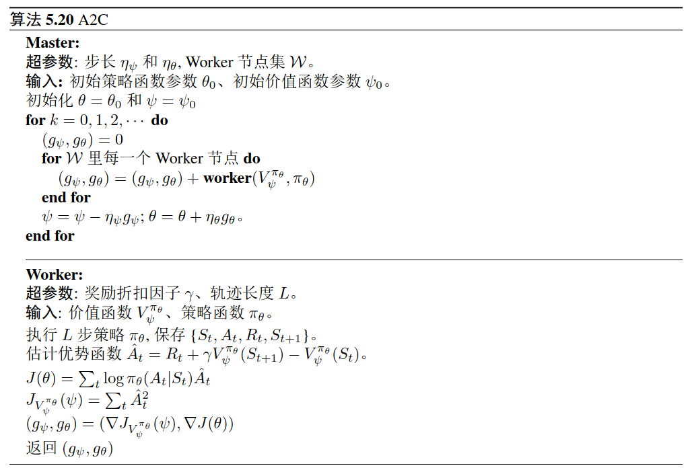
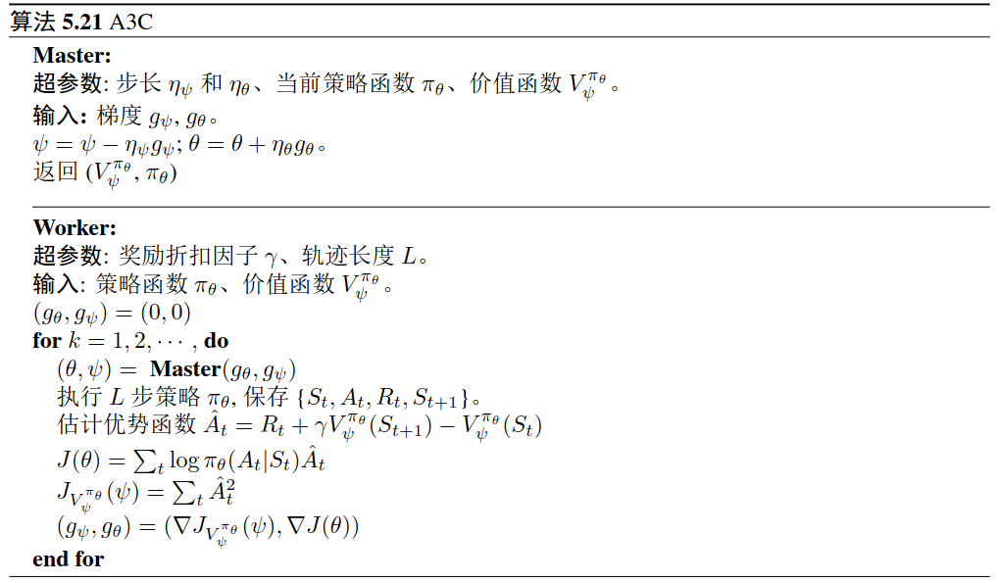

# 策略梯度(PG)

**策略梯度方法**(Policy Gradient Methods)是一类直接针对**期望回报**(Expected Return)通过**梯度下降**(Gradient Descent)进行**策略优化**的增强学习方法。

这一类方法避免了其他传统增强学习方法所面临的一些困难，比如，没有一个准确的价值函数，或者由于连续的状态和动作空间，以及状态信息的不确定性而导致的难解性(Intractability)。

## 简介

和学习 $Q$ 值函数的深度 Q-Learning 方法不同，策略梯度方法直接学习参数化的策略 $\pi_\theta$ 。

- 优点
  - 不需要在动作空间中求解价值最大化的优化问题，从而比较适合解决具有高维或者连续动作空间的问题。
  - 可以很自然地对随机策略进行建模<a href="#ref1">1</a>。
  - 策略梯度方法利用了梯度的信息来引导优化的过程。一般来讲，这样的方法有更好的收敛性保证<a href="#ref1">2</a>。
- 缺点
  - 有估计方差过高的问题。

> 1. 
在价值学习的设定下，智能体需要额外构造它的探索策略，比如 ϵ-贪心，以对随机性策略进行建模。

> 2. 
但一般也仅限于局部收敛性，而不是全局收敛性。

## REINFORCE：初版策略梯度

**REINFORCE**算法在策略的参数空间中直观地通过梯度上升的方法逐步提高策略 $\pi_\theta$ 的性能。

$$ \nabla_\theta J(\pi_\theta)=\mathbb{E}_{\tau\sim\pi_\theta}\left[\sum_{t=0}^\mathrm{T}R_t\nabla_\theta\sum_{t^{\prime}=0}^t\log\pi_\theta(A_{t^{\prime}}|S_{t^{\prime}})\right]=\mathbb{E}_{\tau\sim\pi_\theta}\left[\sum_{t^{\prime}=0}^\mathrm{T}\nabla_\theta\log\pi_\theta(A_{t^{\prime}}|S_{t^{\prime}})\sum_{t=t^{\prime}}^\mathrm{T}R_t\right]\tag{1} $$

注意：上述式子中 $\sum_{t=i}^{\mathrm{T}}R_t$ 可以看成是智能体在状态 $S_i$ 处选择动作 $A_i$，并在之后执行当前策略的情况下，从第 $i$ 步开始获得的累计奖励。事实上，$\sum_{t=i}^{\mathrm{T}}R_t$ 也可以看成 $Q_i(A_i,S_i)$, 在第 $i$ 步状态$S_i$ 处采取动作 $A_i$, 并在之后执行当前策略的 $Q$ 值。

通过给不同的动作所对应的梯度根据它们的累计奖励赋予不同的权重，鼓励智能体选择那些累计奖励较高的动作 $A_{i}$。

只要把上述式子中的 $T$ 替换成 $\infty$ 并赋予$R_t$ 以 $\gamma^t$ 的权重，扩展到折扣因子为 $\gamma$ 的无限范围。

$$\nabla J(\theta)=\mathbb{E}_{\tau\sim\pi_\theta}\left[\sum_{t'=0}^\infty\nabla_\theta\log\pi_\theta(A_{t'}|S_{t'})\gamma^{t'}\sum_{t=t'}^\infty\gamma^{t-t'}R_t\right]\tag{2}$$

由于折扣因子给未来的奖励赋予了较低的权重，使用折扣因子还有助于减少估计梯度时的方差大的问题。实际使用中， $\gamma^{t^{\prime}}$ 经常被去掉，从而避免了过分强调轨迹早期状态的问题。

- 优点
  - 简单直观
- 缺点
  - 对梯度的估计有较大的方差<a href="#ref1">1</a>。

> 1. 
对于一个长度为 L 的轨迹，奖励 $R_t$ 的随机性可能对 L 呈指数级增长。

## 带基准函数的 REINFORCE 算法

为了减轻估计的方差太大这个问题，一个常用的方法是引进一个**基准函数** $b(S_i)$。

对 $b(S_i)$的要求是：它只能是一个关于状态 $S_i$ 的函数（或者更确切地说，它不能是关于 $A_i$ 的函数）。

有了基准函数 $b(S_t)$ 之后，增强学习目标函数的梯度 $\nabla J(\theta)$ 可以表示成

$$\nabla J(\theta)=\mathbb{E}_{\tau\sim\pi_\theta}\left[\sum_{t'=0}^\infty\nabla_\theta\log\pi_\theta(A_{t'}|\:S_{t'})\left(\sum_{t=t'}^\infty\gamma^{t-t'}R_t-b(S_{t'})\right)\right]\tag{3}$$

这是因为

$$\mathbb{E}_{\tau,\theta}\left[\nabla_\theta\log\pi_\theta(A_{t^{\prime}}|S_{t^{\prime}})b(S_{t^{\prime}})\right]=\mathbb{E}_{\tau,\theta}\left[b(S_{t^{\prime}})\mathbb{E}_\theta\left[\nabla\log\pi_\theta(A_{t^{\prime}}|S_{t^{\prime}})|S_{t^{\prime}}\right]\right]=0$$

带基准函数的 REINFORCE 算法具体步骤如图1所示。

图1 带基准函数的 REINFORCE 算法

直观来讲，从奖励函数中减去一个基准函数这个方法是一个常见的降低方差的方法。

假设需要估计一个随机变量 $X$ 的期望 $\mathbb{E}[X]$。对于任意一个期望为 0 的随机变量 $Y$, 我们知道 $X-Y$ 依然是$\mathbb{E}\left[X\right]$的一个无偏估计。而且，$X-Y$ 的方差为

$$\mathbb{V}(X-Y)=\mathbb{V}(X)+\mathbb{V}(Y)-2\text{cov}(X,Y)\tag{4}$$

式子中的 $V$ 表示方差， $cov( X, Y)$ 表示 $X$ 和 $Y$ 的协方差。所以如果 $Y$ 本身的方差较小，而且和 $X$ 高度正相关，那么 $X-Y$ 会是一个方差较小的关于 $\mathbb{E}[X]$ 的无偏估计。在策略梯度方法中，**基准函数的常见选择是状态价值函数** $V(S_i)$。

这个算法和初版的 Actor-Critic 算法很相像。

## Actor-Critic

**Actor-Critic**算法是一个既基于策略也基于价值的方法。

在初版策略梯度方法中可以用状态价值函数作为**基准函数**来降低梯度估计的方差。Actor-Critic 算法也沿用了相同的想法，同时学习**演员**(Actor)函数(也就是智能体的*策略函数* $\pi(\cdot|s)$ 和**评论家**(Critic)函数也就是*状态价值函数* $V^\pi(s)$) 。

此外，Actor-Critic 算法还沿用了**自举法**(Bootstrapping)的思想来估计 $Q$ 值函数。REINFORCE 中的误差项 $\sum_{t=i}^\infty\gamma^{t-i}R_t-b(S_i)$ 被**时间差分误差**取代了，即 $R_i+\gamma V^{\pi}(S_{i+1})-V^{\pi}(S_i)$。

我们这里采用 $L$ 步的时间差分误差，并通过最小化该误差的平方来学习批判者函数 $V_\psi^{\pi_\theta}(s)$ 即

$$\psi\leftarrow\psi-\eta_{\psi}\nabla J_{V_{\psi}^{\pi_{\theta}}}(\psi)\tag{5}$$

式子中 $\psi$ 表示学习批判者函数的参数， $\eta_\mathrm{\psi}$ 是学习步长，并且

$$J_{V_{\psi}^{\pi_{\theta}}}\left(\psi\right)=\frac{1}{2}\left(\sum_{t=i}^{i+L-1}\gamma^{t-i}R_{t}+\gamma^{L}V_{\psi}^{\pi_{\theta}}\left(S'\right)-V_{\psi}^{\pi_{\theta}}\left(S_{i}\right)\right)^{2}\tag{6}$$

$S^{\prime}$ 是智能体在 $\pi_{\theta}$ 下 $L$ 步之后到达的状态，所以

$$\nabla J_{V_{\psi}^{\pi_{\theta}}}(\psi)=\left(V_{\psi}^{\pi_{\theta}}(S_{i})-\sum_{t=i}^{i+L-1}\gamma^{t-i}R_{t}-\gamma^{L}V_{\psi}^{\pi_{\theta}}(S^{\prime})\right)\nabla V_{\psi}^{\pi_{\theta}}(S_{i})\tag{7}$$

 类似地，行动者函数 $\pi_\theta(\cdot|s)$ 决定每个状态 $s$ 上所采取的动作或者动作空间上的一个概率分布。我们采用和初版策略梯度相似的方法来学习这个策略函数。

$$\theta=\theta+\eta_\theta\nabla J_{\pi_\theta}(\theta)\tag{8}$$

这里 $\theta$ 表示行动者函数的参数，$\eta_\mathrm{\theta}$ 是学习步长，并且

$$\nabla J(\theta)=\mathbb{E}_{\tau,\theta}\left[\sum_{i=0}^{\infty}\nabla\log\pi_\theta(A_i|\:S_i)\left(\sum_{t=i}^{i+L-1}\gamma^{t-i}R_t+\gamma^LV_\psi^{\pi_\theta}(S')-V_\psi^{\pi_\theta}(S_i)\right)\right]\tag{9}$$

注意，我们这里分别用了 $\theta$ 和 $\psi$ 来表示策略函数和价值函数的参数。在实际应用中，当我们选择用神经网络来表示这两个函数的时候，经常会让两个网络共享一些底层的网络层作为共同的状态表征(State Representation)。此外，AC 算法中的 $L$ 值经常设为 1, 也就是 TD(0) 误差。

AC算法的具体步骤如图2所示。

图2 Actor-Critic 算法

值得注意的是，AC 算法也可以使用 $Q$ 值函数作为其批判者。在这种情况下，优势函数可以用以下式子估计。

$$Q(s,a)-V(s)=Q(s,a)-\sum_a\pi(a|s)Q(s,a)\tag{10}$$

用来学习 $Q$ 值函数这个批判者的损失函数为

$$J_Q=\left(R_t+\gamma Q(S_{t+1},A_{t+1})-Q(S_t,A_t)\right)^2\tag{11}$$

或者

$$J_Q=\left(R_t+\gamma\sum_a\pi_\theta(a|S_{t+1})Q(S_{t+1},a)-Q(S_t,A_t)\right)^2\tag{12}$$

这里动作 $A_{t+1}$ 由当前策略 $\pi_{\theta}$ 在状态 $S_{t+1}$ 下取样而得。

### 生成对抗网络和 Actor-Critic

初看上去，生成对抗网络（GAN）和Actor-Critic 应该是截然不同的算法，用于不同的机器学习领域，一个是生成模型，而另一个是强化学习算法。但是实际上它们的结构十分类似。
对于 GAN，有两个部分：用于根据某些输入生成对象的生成网络，以及紧接生成网络的用于判断生成对象真实与否的判别网络。

对于 Actor-Critic方法，也有两部分：根据状态输入生成动作的动作网络，以及一个紧接动作网络之后用价值函数（比如下一个动作的价值或 Q 值）评估动作好坏的批判网络。

因此，GAN 和 Actor-Critic 基本遵循相同的结构。

在这个结构中有两个相继的部分：一个用于生成物体，第二个用一个分数来评估生成物体的好坏；随后选择一个优化过程来使第二部分能够准确评估，并通过第二部分反向传播梯度到第一部分来保证它生成我们想要的内容，通过一个定义为损失函数的标准，也就是一个来自结构第二部分的分数或价值函数来实现。

GAN 和 Actor-Critic 的结构详细比较如图3所示。在 GAN 中，$z$ 是输入的噪声变量，它可以从如正态分布中采样，而 $x$ 是从真实目标中采集的数据样本。在 Actor-Critic 中， $s$ 和 $a$ 分别表示状态和动作。

图3 对比GAN和Actor-Critic的结构

- 对第一个生成物体的部分：GAN 中的生成器和 Actor-Critic 中的行动者基本一致，包括其前向推理过程和反向梯度优化过程。对于前向过程，生成器采用随机变量做输入，并输出生成的对象；对于方向优化过程，它的目标是最大化对生成对象的判别分数。行动者用状态作为输入并输出动作，对于优化来说，它的目标是最大化状态-动作对的评估值。

- 对于第二个评估物体的部分：判别器和批判者由于其功能不同而优化公式也不同，但是遵循相同的目标。判别器有来自真实对象额外输入。它的优化规则是最大化真实对象的判别值而最小化生成对象的判别值，这与我们的需要相符。对于批判者，它使用时间差分（TemporalDifference，TD）误差作为强化学习中的一种自举方法来按照最优贝尔曼方程优化价值函数。也有一些其他模型彼此非常接近。举例来说，自动编码器（Auto-Encoder，AE）和 GAN 可以是彼此的相反结构等。注意到，不同深度学习框架中的相似性可以帮助你获取关于现有不同领域方法共性的认识，而这有助于为未解决的问题提出新的方法。

## A2C

同步优势 Actor-Critic（Synchronous Advantage Actor-Critic，A2C）和上一节讨论的 Actor-Critic 算法非常相似，只是在 Actor-Critic 算法的基础上增加了并行计算的设计。

如图4所示，全局行动者和全局批判者在 Master 节点维护。每个 Worker 节点的增强学习智能体通过协调器和全局行动者、全局批判者对话。在这个设计中，协调器负责收集各个 Worker 节点上与环境交互的经验（Experience），然后根据收集到的轨迹执行一步更新。更新之后，全局行动者被同步到各个 Worker 上继续和环境交互。在 Master 节点上，全局行动者和全局批判者的学习方法和 Actor-Critic 算法中行动者和批判者的学习方法一致，都是使用 TD 平方误差作为批判者的损失函数，以及 TD 误差的策略梯度来更新行动者的。

图4 A2C 基本框架

在这种设计下，Worker 节点只负责和环境交互。所有的计算和更新都发生在 Master 节点。实际应用中，如果希望降低 Master 节点的计算负担，一些计算也可以转交给 Worker 节点<a href="#ref1">1</a>，比如说，每个 Worker 节点保存了当前全局批判者（Critic）。收集了一个轨迹之后，Worker 节点直接在本地计算给出全局行动者（Actor）和全局批判者的梯度。这些梯度信息继而被传送回 Master 节点。最后，协调器负责收集和汇总从各个 Worker 节点收集到的梯度信息，并更新全局模型。同样地，更新后的全局行动者和全局批判者被同步到各个 Worker 节点。

> 1. 
这经常取决于每个 Worker 节点的计算能力，比如是否有 GPU 计算能力，等等。

图5 A2C 算法

## A3C

异步优势 Actor-Critic（Asynchronous Advantage Actor-Critic, A3C） A2C 的异步版本。在 A3C 的设计中，协调器被移除。每个 Worker 节点直接和全局行动者和全局批判者进行对话。Master 节点则不再需要等待各个 Worker 节点提供的梯度信息，而是在每次有 Worker 节点结束梯度计算的时候直接更新全局 Actor-Critic。由于不再需要等待，A3C 有比A2C 更高的计算效率。但是同样也由于没有协调器协调各个 Worker 节点，Worker 节点提供梯度信息和全局 Actor-Critic 的一致性不再成立，即每次 Master 节点从 Worker 节点得到的梯度信息很可能不再是当前全局 Actor-Critic 的梯度信息。

注意：虽然 A3C 为了计算效率而牺牲 Worker 节点和 Master 节点的一致性这一点看起来有些特殊，这种异步更新的方式在神经网络的更新中其实非常常见。近期的研究 (Mitliagkas et al., 2016)还表明，异步更新不仅加速了学习，还自动为 SGD 产生了类似于动量（Momentum）的效果。

图6 A3C 算法
