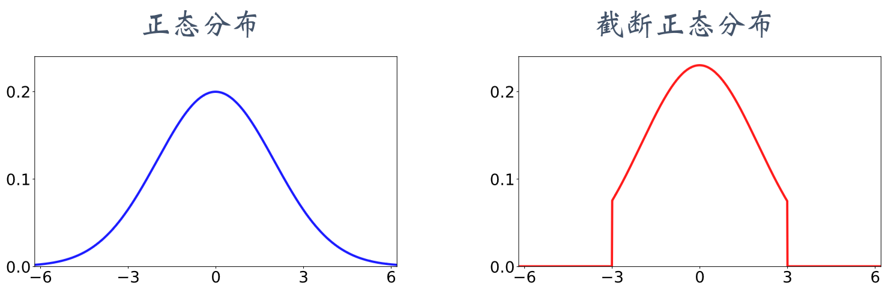

# 双延时确定策略梯度（TD3）

由于存在高估等问题，DPG 实际运行的效果并不好。

## 高估问题的解决方案

解决方案——截断双 Q 学习（clipped double Q-learning）：这种方法使用两个价值网络和一个策略网络：

$$
q(s,a;w_1),\quad q(s,a;w_2),\quad \mu(s;\theta)
$$
三个神经网络各对应一个目标网络：

$$
q(s,a;w_{1}^-),\quad q(s,a;w_{2}^-),\quad \mu(s;\theta^-)
$$

用目标策略网络计算动作：

$$
a_{j+1}^{-} = \mu(s_{j+1};\theta^{-})\tag{1}
$$

然后用两个目标价值网络计算：

$$
\begin{align}
\hat{y}_{j,1}=r_j+\gamma\cdot q(s_{j+1},\hat{a}_{j+1}^-;w_1^-)\tag{2}
\\
\hat{y}_{j,2}=r_j+\gamma\cdot q(s_{j+1},\hat{a}_{j+1}^-;w_2^-)\tag{3}
\end{align}
$$

取较小值为TD目标：
$$
\hat{y}_j = \min\{\hat{y}_{j,1}, \hat{y}_{j,2}\}\tag{4}
$$

截断双 Q 学习中的六个神经网络的关系如图 所示

TD3六个神经网络的关系图

## 其他改进方法

### 往动作中加噪声

截断双 Q 学习用目标策略网络计算动作：目标策略网络 $a_{j+1}^{-} = \mu(s_{j+1};\theta^{-})$。把这一步改成：

$$
a_{j} = \mu(s_{};\theta_{\text{now}}) + \xi\tag{5}
$$
公式中的 ξ 是个随机向量，表示噪声，它的每一个元素独立随机从截断正态分布（clippednormal distribution）中抽取。把截断正态分布记作 $CN(0,\sigma^2,-c,c)$, 意思是均值为零，标准差为$\sigma$ 的正态分布，但是变量落在区间 $[-c,c]$ 之外的概率为零。

正态分布与截断正态分布的对比如图所示。使用截断正态分布，而非正态分布，是为了防止噪声$\xi$过大。使用截断，保证噪声大小不会超过 $-c$ 和 $c$。

正态分布和截断正态分布

### 减小更新策略网络和目标网络的频率

Actor-critic 用价值网络来指导策略网络的更新。如果价值网络 $q$ 本身不可靠，那么用价值网络 $q$ 给动作打的分数是不准确的，无助于改进策略网络 $\mu$。在价值网络 $q$ 还很差的时候就急于更新 $\mu$，非但不能改进 $\mu$，反而会由于 $\mu$ 的变化导致 $q$ 的训练不稳定。

 实验表明，应当让策略网络 $\mu$ 以及三个目标网络的更新慢于价值网络 $q$。传统的actor-critic 的每一轮训练都对策略网络、价值网络、以及目标网络做一次更新。更好的方法是每一轮更新一次价值网络，但是每隔 $k$ 轮更新一次策略网络和三个目标网络。$k$ 是超参数，需要调。

# 训练流程

TD3 与 DPG 都属于异策略 (off-policy), 可以用任意的行为策略收集经验，事后做经验回放训练策略网络和价值网络。

收集经验的方式与原始的训练算法相同，用 $a_t=\mu(s_t;\theta)+\epsilon$ 与环境交互，把观测到的四元组 $(s_t,a_t,r_t,s_{t+1})$ 存入经验回放数组。

初始的时候，策略网络和价值网络的参数都是随机的。这样初始化目标网络的参数：
$$
w_1^-\leftarrow w_1,\quad w_2^-\leftarrow w_2,\quad \theta^- \leftarrow \theta.
$$
训练策略网络和价值网络的时候，每次从数组中随机抽取一个四元组，记作$(s_j,a_j,r_j,s_{j+1})$。用下标 now 表示神经网络当前的参数，用下标 new 表示更新后的参数。然后执行下面的步骤，更新价值网络、策略网络、目标网络。

1.  让目标策略网络做预测:  $\hat{a}_{j+1}^- = \mu(s_{j+1}; \theta_{\text{now}}^-)+\xi$。其中向量$\xi$ 的每个元素都独立从截断正态分布 $\mathcal{CN}(0,\sigma^2,-c,c)$ 中抽取。
2. 让两个目标价值网络做预测：
$$
\hat{q}_{1,j+1}^- = q(s_{j+1},\hat{a}_{j+1}^- ;w_{1,\text{now}} ^ - ) \quad \text{和} \quad \hat{q}_{2,j+1}^- = q(s_{j+1},\hat{a}_{j+1}^- ;w_{2,\text{now}} ^ - )
$$
3. 计算 TD 目标：
$$
\hat{y}_j=r_j+\gamma\cdot\min\{\hat{q}_{1,j+1}^-,\hat{q}_{2,j+1}^-\}
$$
4. 让两个价值网络做预测：
$$
\hat{q}_{1,j}=q(s_j,a_j;w_\text{1,now}) \quad \text{和} \quad \hat{q}_{2,j}=q(s_j,a_j;w_\text{2,now})
$$
5. 计算 TD 误差：
$$
\delta_{1,j}=\hat{q}_{1,j+1}^- - \hat{y}_{j} \quad \text{和} \quad \delta_{2,j}=\hat{q}_{2,j+1}^- - \hat{y}_{j}
$$
6. 更新价值网络：
$$
w_{\text{1,new}} \leftarrow w_{\text{1,now}}-\alpha\cdot\delta_{1,j}\cdot\nabla_w q(s_j,a_j;w_\text{1,now}) \quad \text{和} \quad w_{\text{2,new}} \leftarrow w_{\text{2,now}}-\alpha\cdot\delta_{2,j}\cdot\nabla_w q(s_j,a_j;w_\text{2,now})
$$
7. 每隔 $k$ 轮更新一次策略网络和三个目标网络：
   1. 让策略网络做预测：$a_{j} = \mu(s_{};\theta_{\text{now}}) + \epsilon$。然后更新策略网络：
   $$
   \theta_\text{new}\leftarrow\theta_\text{now}+\beta\cdot\nabla_{\theta}mu(s_j;\theta_\text{now})\cdot\nabla_{a}q(s_j,\hat{a}_j;w_{1,now})
   $$
   2. 更新目标网络的参数：
   $$
   \begin{align}
   \theta_{\text{new}}^{-} &\leftarrow \tau\cdot \theta_{\text{new}} + (1 - \tau)\cdot \theta_{\text{now}}^{-}
   \\
   w_\text{1,new}^{-} &\leftarrow \tau\cdot w_\text{1,new}+(1-\tau)\cdot w_\text{1,now}^{-}
   \\
   w_\text{2,new}^{-} &\leftarrow \tau\cdot w_\text{2,new}+(1-\tau)\cdot w_\text{2,now}^{-}
   \end{align}
   $$

TD3训练流程

